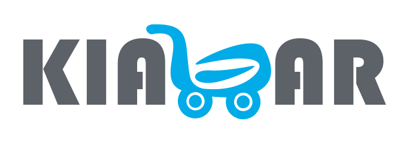

# Kiazarco Website



**Live Demo:** [abyaab.ir](http://kiazarco.com)

Kiazarco is a supplier of consumable goods for organizations, hotels, and restaurants.  
Our mission is to simplify the purchasing process while ensuring a high-quality and cost-effective experience, addressing all customer needs throughout every stage of procurement.

---

## Features
- **Responsive Design:** Works perfectly on desktop, tablet, and mobile.
- **Fast Performance:** Optimized with Vite for blazing-fast load times.
- **Clean Codebase:** Written in Vanilla JavaScript for maintainability.
- **Modern Build Tooling:** Hot Module Replacement (HMR) during development.

---

## Tech Stack
- **Frontend:** Vanilla JavaScript
- **Build Tool:** Vite

---

## Getting Started

### Prerequisites
Make sure you have **Node.js** (v16 or later) installed on your machine.

### Installation
```bash
# Clone the repository
git clone https://github.com/jvd-malek/kiazar.git

# Navigate into the project folder
cd kiazar

# Install dependencies
npm install

# Development
npm run dev

# Production Build
npm run build

# Preview Production Biuld
npm run preview
```

---

## Licence
This project is licensed under the MIT Licence
